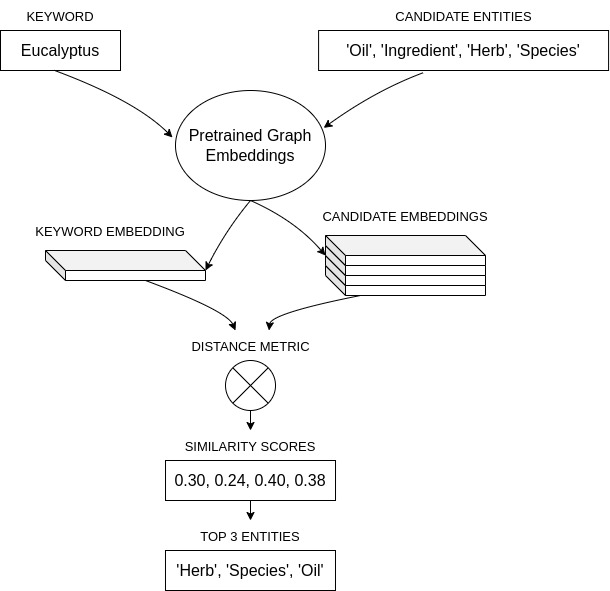

# kg-ned
Given a keyword and a list of candidate entities, the NED model first fetches the graph embeddings for all the candidates as well as the  keyword and calculates the similarity between them. From the similarities, the top N matches are then returned as the target entities.

## Overview of Architecture

## Installation
- Install the dependencies using `pip install -r requirements.txt`.
- Using sample keyword, demo can be run using the `demo.ipynb` file.

## Improvements
- Using graph embeddings from GraphVite https://graphvite.io.
- Using Pytorch Big Graph Model https://github.com/facebookresearch/PyTorch-BigGraph.
- Use a better entity ranking approach.
